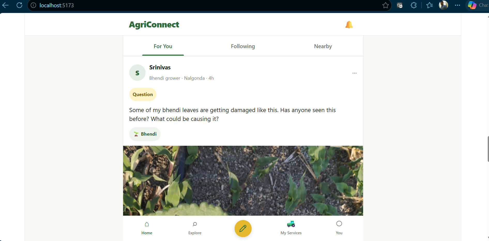
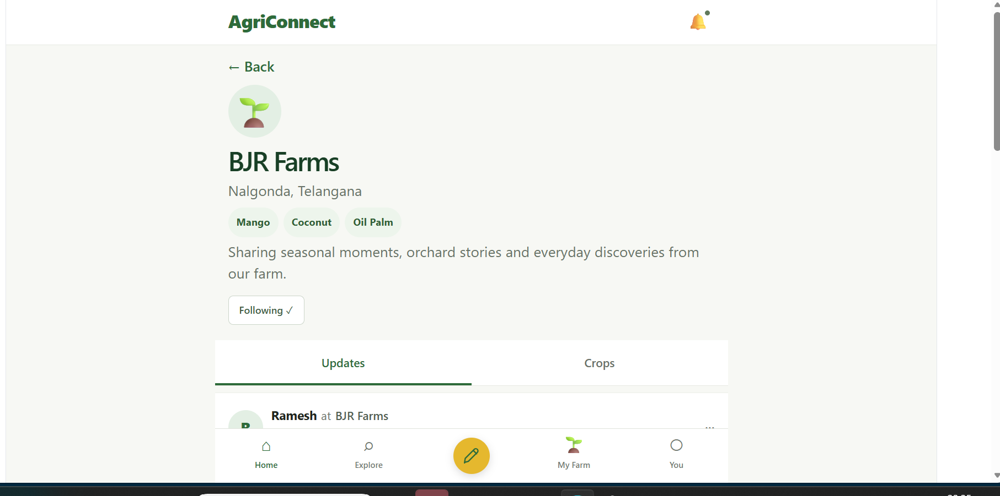
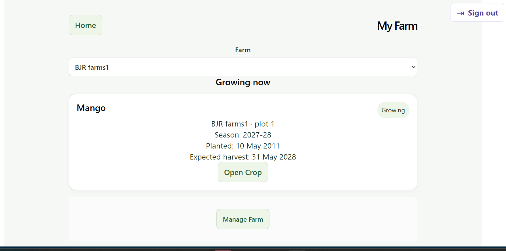
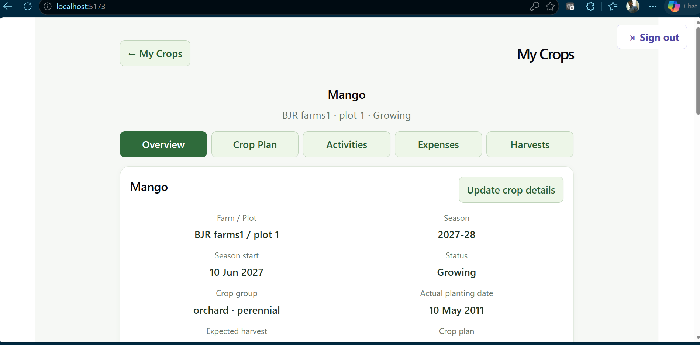
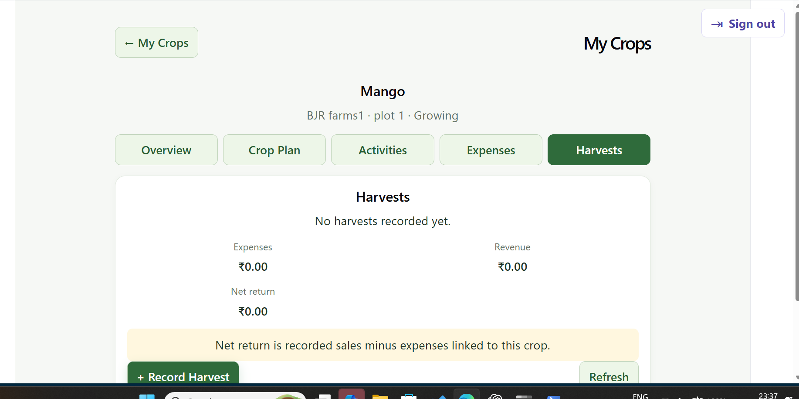

# AgriConnect

AgriConnect is an agricultural services marketplace extended into a farm operations application and a farm-centric social experience. It connects service booking with crop planning, field verification, recorded work, expenses, harvests and sales, while keeping operational workflows available alongside social discovery.

This case study demonstrates engineering relevant to Forward Deployed Engineer and AI Solution Engineer work: translating domain workflows into software, integrating existing systems, modelling permissions and data boundaries, and delivering tested increments. It does not claim an implemented AI system, production deployment or commercial adoption.

## The problem and product evolution

Booking an agricultural service is only one part of running a farm. The surrounding workflow needs to answer: what should happen on a crop, what was observed in the field, what work actually happened, what it cost, and what was harvested and sold. AgriConnect brings these records together around farms and crop production periods. The social experience adds discovery of people, farms and crops and sharing of farming and village-life moments.

The implementation evolved incrementally, reusing existing identities, records and workflows:

| Stage | Capability and repository evidence |
| --- | --- |
| Agricultural services marketplace | Farmer/provider onboarding, services, availability and bookings form the foundation in [the main API](backend/main.py) and [booking regression tests](backend/tests/test_booking_regression.py). |
| Crop and farm operations | [Slice 1](CROP_MANAGEMENT_SLICE1.md) reuses `farm_crops` for crop cycles and adds versioned standard operating procedures (SOPs), generated plans and task execution. |
| Field verification | [Slice 2A](CROP_MANAGEMENT_SLICE2A.md) documents backend/domain support for officer assignments, visits, factual observations and task verification; this does not establish a completed browser workspace. |
| Activities, expenses and inputs | [Slice 2B](CROP_MANAGEMENT_SLICE2B.md) adds farm/crop work and expense records; [Slice 2C](CROP_MANAGEMENT_SLICE2C.md) adds planting and input snapshots. [Slice 2D](CROP_MANAGEMENT_SLICE2D.md) refines Current/History and farm/plot/block navigation. |
| Harvest, revenue and lifecycle | [Slice 3](CROP_MANAGEMENT_SLICE3.md) records harvests and sales and derives revenue, costs and net return. [Slice 4](CROP_MANAGEMENT_SLICE4.md) adds reconciliation, completion and separate seasons for continuing perennial plantings. |
| Service integration and season planning | [Slice 5](CROP_MANAGEMENT_SLICE5.md) connects crop tasks to existing marketplace bookings, then farmer-confirmed work and actual expenses. [Slice 6](CROP_MANAGEMENT_SLICE6.md) extends scheduling and season planning. |
| Shared access | [Slice 7](CROP_MANAGEMENT_SLICE7.md) extends shared signup with reviewed Field Officer applications and capability-based access. |
| Farm-centric social experience | [Social components](frontend/src/social) add Home, Explore, crop/farm/people discovery, profiles, posting, interactions and separate person/farm following. [App](frontend/src/App.jsx) connects social and operational navigation. |

**Evidence boundary:** pre-social evolution is evidenced by code, [explicit migrations](backend/alembic/versions), and the `CROP_MANAGEMENT_SLICE1` through `CROP_MANAGEMENT_SLICE7` documents above, including Slice 2A–2D. Git does not independently record that entire earlier journey. Git starts at `d7a671e` — **Baseline AgriConnect before social UI evolution** — and records 18 subsequent social evolution commits through `f3cc498` — **Complete operational and social navigation checkpoint**. Those commits cover Home, Explore, reusable components, profiles, composing, interactions, replies, sharing, following, attribution, farm/crop context and integrated navigation.

## Current capabilities

**Operational application:** backend-backed workflows cover onboarding, farms and plots, marketplace services and bookings, crop plans and tasks, field visits and verification, activities and expenses, inputs, harvests and sales, production completion, perennial seasons and officer applications. Role and capability checks distinguish farmer, provider, officer and admin access. Field Officer assignments, visits, observations and verification are backend-supported and documented; frontend components and routing exist, but a completed, end-to-end browser-validated officer workspace is not claimed here. The slice documents provide APIs, validation results and manual walkthroughs.

**Social prototype:** Home and Explore support sample farming and village-life content, crop discovery, farm and person profiles, a lightweight composer, session-created posts, reactions, comments/replies, sample notifications, sharing and a Following feed. [SocialShell](frontend/src/social/SocialShell.jsx) uses [sample data](frontend/src/social/mockSocialData.js) and in-memory React state; posts, follows and interactions are not a durable multi-user backend. [PostCard](frontend/src/social/PostCard.jsx) shares text through native sharing or clipboard copying; this does not establish a publicly hosted post service.

**Separate person and farm identities:** people and farms have distinct profiles and follow lists. Post attribution and optional farm/crop context let a person share a moment associated with a farm without treating the farm as the person. The [public context normalizer](frontend/src/social/publicPostContext.js) copies selected identity/display fields, distinguishes canonical operational references from sample social identities, and uses the crop catalogue ID rather than a private cultivation record ID.

## Product Walkthrough

### 1. Social Home



Useful farming content and questions anchor the social experience, with person attribution and crop/farm context where available. This is the sample-data social prototype described above, with session-only interactions rather than a production-complete social backend.

### 2. Farm Identity



The product models a farm as a persistent social identity with its own profile and followers, separate from a person or login actor. People and farms remain distinct identities; durable social persistence is still outside the current prototype.

### 3. My Farm / Operational Bridge



The farmer workspace connects the social-facing experience to operational farm data and active/planned crops. Users can enter existing crop operations from this workspace, reusing the operational system without duplicating it.

### 4. Crop Operations



The crop lifecycle workspace brings together Overview, Crop Plan, Activities, Expenses and Harvests. Social capabilities were added while preserving this existing operational foundation.

### 5. Harvest & Revenue



The crop workflow extends through harvest, sales/revenue, expenses and net-return/reconciliation concepts. Empty or demo values illustrate the workflow; they are not evidence of real commercial transactions or production data.

## Architecture and technology

| Layer | Implementation |
| --- | --- |
| Frontend | React 19, Vite 8, JavaScript/JSX and CSS; i18next/react-i18next with English and Telugu locale files. See [dependencies](frontend/package.json) and [source](frontend/src). |
| API and authentication | Python, FastAPI and Uvicorn; JWT authentication with PyJWT and password hashing with pwdlib. [main.py](backend/main.py) integrates domain modules for crops, field work, farm records, harvests, lifecycle and task services. |
| Persistence | PostgreSQL via SQLAlchemy Core, handwritten SQL and psycopg; explicit Alembic revisions. See [dependencies](backend/requirements.txt) and [migrations](backend/alembic/versions). |
| Local request flow | Browser → `/api` → [Vite development proxy](frontend/vite.config.js) → FastAPI → PostgreSQL. Social sample data and session interactions currently live in the frontend. |
| Verification and operations | [pytest/API and concurrency tests](backend/tests), [guarded migration helper](backend/scripts/migrate_local.py), [health check](backend/health_check.py) and [PostgreSQL backup script](backend/scripts/backup_database.ps1). |

## Key engineering decisions

- **Extend the existing model.** Crop cycles reuse `farm_crops`; perennial seasons use crop records for execution, connected by a planting identity. Existing links to work, costs and harvests are retained instead of rewriting the execution model. See [Slice 1](CROP_MANAGEMENT_SLICE1.md) and [Slice 4](CROP_MANAGEMENT_SLICE4.md).
- **Preserve issued plans.** Versioned SOPs and immutable task snapshots prevent future template edits from rewriting existing crop plans. Explicit date anchors and classified scheduling do not imply automatic agronomic event detection. See [Slice 6](CROP_MANAGEMENT_SLICE6.md).
- **Separate verification, execution and money.** Officer verification does not complete farmer tasks. Booking does not automatically establish completed work or expenditure; farmer confirmation records those facts, and the existing expense ledger remains the cost source. See [Slice 2A](CROP_MANAGEMENT_SLICE2A.md), [Slice 3](CROP_MANAGEMENT_SLICE3.md) and [Slice 5](CROP_MANAGEMENT_SLICE5.md).
- **Reuse integration paths.** Task-linked service requests use the existing booking endpoint and transaction, retaining availability and capacity checks. Optional origins and snapshots preserve context without a second booking system. See [Slice 5](CROP_MANAGEMENT_SLICE5.md).
- **Handle retries and conflicts explicitly.** Request keys, expected-state checks, row locks and database constraints protect relevant mutations from duplicates and stale writes. [Concurrency tests](backend/tests/test_task_service_concurrency.py) exercise competing database operations.
- **Enforce access on the server.** Shared authentication and capabilities retain farmer/provider access while officer actions require the relevant assignment. Signup intent alone grants no officer authority. See [Slice 7](CROP_MANAGEMENT_SLICE7.md) and [field-work implementation](backend/field_work.py).

## Evidence, reliability and limits

**378 passing backend tests** are recorded in [Slice 7 validation](CROP_MANAGEMENT_SLICE7.md): 348 baseline tests plus 30 additional tests. This is a documented validation checkpoint, not a claim that every checkout or environment has just been tested. The [suite](backend/tests) covers security, onboarding, bookings, crop management, field work, farm records, inputs, harvests, production lifecycle, season planning, officer applications, database operations and concurrency scenarios.

The [test database guard](backend/tests/conftest.py) requires a distinct test-named database and checks the connected database identity. Explicit migrations, historical-data checks documented in the slice reports, and the backup/restore instructions below support controlled changes. Slice 7 records successful frontend build/lint checks with existing warnings; the slice reports distinguish automated validation from manual browser checks.

These are implementation and local validation results. They do not establish production scale, deployment availability, commercial usage or end-to-end social persistence. Crop planning uses configured SOPs and explicit scheduling; no AI diagnosis, recommendation engine or automated agronomic decision-making is claimed. Provider-document malware scanning remains deferred, as noted below.

## Technical setup and implementation documentation

The existing local setup, test, migration, backup/restore and slice reference instructions follow.

## Working baseline

- Python 3.14.7
- PostgreSQL
- React + Vite frontend

## Backend setup (Windows PowerShell)

From the project root:

```powershell
py -3.14 -m venv .venv
.\.venv\Scripts\Activate.ps1
pip install -r backend\requirements.txt
Copy-Item backend\.env.example backend\.env
```

Set the required database and JWT values in `backend\.env`. PostgreSQL must
be running and the configured `DB_NAME` database must already exist.

`LOG_LEVEL` is optional and defaults to `INFO`. Standard Python levels such as
`DEBUG`, `INFO`, `WARNING`, `ERROR`, and `CRITICAL` are supported; invalid
values safely use `INFO`.

For pilot configuration, `CORS_ORIGINS` and `TRUSTED_HOSTS` accept
comma-separated values. Their local defaults preserve Vite development; add
the relevant LAN address or deployed hostname when needed. Set
`ENABLE_API_DOCS=false` to disable `/docs`, `/redoc`, and `/openapi.json`.

Provider verification uploads are stored locally by default in
`backend/storage/provider_documents`. Configure `DOCUMENT_STORAGE_DIR` and
`MAX_DOCUMENT_UPLOAD_MB` (default `5`) for a pilot environment. Storage is
not publicly served; providers and admins access uploaded documents through
authenticated API routes. Malware/antivirus scanning remains a future
production requirement.

Start the backend:

```powershell
cd backend
uvicorn main:app --reload
```

## Frontend setup

In another PowerShell window, from the project root:

```powershell
cd frontend
npm install
npm run dev
```

## Tests

From `backend`:

```powershell
..\.venv\Scripts\python.exe -m pytest
```

Tests require a dedicated `AGRI_TEST_DB_NAME`. It must be non-empty, differ
from `DB_NAME`, contain `test`, and match PostgreSQL's `current_database()`.
The suite refuses to run if these safeguards are not met.

## Database migrations

Run these commands from `backend` with the virtual environment active:

```powershell
alembic current
alembic history
alembic upgrade head
alembic revision -m "description"
```

The baseline migration was derived from the existing PostgreSQL schema. Do
not run its `upgrade` against an existing AgriConnect database: first verify
its schema matches the baseline, then use `alembic stamp 44d0107abf58`.

AgriConnect uses SQLAlchemy Core and handwritten SQL rather than complete
declarative metadata. Do not treat `alembic revision --autogenerate` as
authoritative. Future schema changes must be written and reviewed explicitly
as Alembic revisions; each new table, column, index, constraint, or nullable
change needs a revision.

The baseline downgrade is intentionally unsupported because it would be
destructive. Test any future downgrade only on a disposable database.

## Database operations

Before a significant pilot migration, create and verify a backup. On Windows:

```powershell
powershell -ExecutionPolicy Bypass -File .\backend\scripts\backup_database.ps1
```

The script reads database settings from process environment variables or
`backend\.env`, writes a timestamped PostgreSQL custom-format dump to
`backend\backups`, and never prints the database password. It requires
`pg_dump` to be installed and available on `PATH`.

Test a restore only in a new disposable database, never the active pilot
database. Use PostgreSQL credentials through a secure prompt or environment,
then run commands like these from PowerShell:

```powershell
createdb --host=<host> --port=<port> --username=<user> agriconnect_restore_check
pg_restore --host=<host> --port=<port> --username=<user> --dbname=agriconnect_restore_check .\backend\backups\<backup.dump>
```

Verify schema/table presence and application health against that new database
before considering any recovery procedure. Do not use `--clean`, `dropdb`, or
an active pilot database as the restore target.

Existing databases use Alembic revision tracking. New schema changes require
explicit reviewed revisions; autogenerate is not authoritative because the
application uses handwritten SQL. Do not make ad-hoc production schema
changes, and retain the dedicated test-database safeguards described above.

## Account onboarding

Sign-in accepts a mobile number or email with the existing password. Registration
requires at least one contact method; email is optional. Phone formatting spaces,
parentheses, hyphens and a leading plus are ignored for lookup.

The frontend resumes setup from saved data on sign-in/reload. Farmers create a
farm and service address using FarmSetup. Providers complete ProviderProfile and
add their first service using MyServices. Becoming a provider reuses the farmer's
account and retains farmer access. Provider setup is complete in the UI only
after a service has been saved; existing API capability checks are retained.

Before running this version against another existing database, apply the optional
email migration from `backend`:

```powershell
..\.venv\Scripts\python.exe -m alembic upgrade head
```

This changes only `users.email` nullability; unique email/phone constraints remain.
Existing installations must already be stamped at the baseline revision as
specified in the database setup instructions. Do not run the baseline creation
against an existing unstamped schema.

Onboarding regression coverage is in `backend/tests/test_onboarding.py`. Run the
backend test suite from `backend` against the guarded test database described in
`backend/tests/README.md`.

## Crop Management Slice 1

The additive Crop Management module is documented in
[CROP_MANAGEMENT_SLICE1.md](CROP_MANAGEMENT_SLICE1.md), including APIs, guarded
migration commands, validation results, and manual admin/farmer test steps.
Farmer entry: **My Crops**. Admin entry: **Manage Crop SOPs**.

## Crop Management Slice 2A

Backend/domain support for assignment-scoped officer visits, task verification and
factual observations is documented in [CROP_MANAGEMENT_SLICE2A.md](CROP_MANAGEMENT_SLICE2A.md).
Frontend components and routes exist for **My Field Work**, **Manage Field Work**
and farmer field-work updates. These entry points and the documented walkthroughs
should not be read as evidence of a completed, end-to-end browser-validated Field
Officer workspace.

## Crop/Farm Management Slice 2B

Shared actual activities, expenses and optional plot blocks are documented in
[CROP_MANAGEMENT_SLICE2B.md](CROP_MANAGEMENT_SLICE2B.md), including schema/API
decisions, migration status, validation and browser/mobile test steps.
Farmer entry: **My Crops**, then **Activities / Expenses** on a crop or
**Farm Activities & Expenses / Manage Blocks** for farm-wide history.

## Crop/Farm Management Slice 2C

Optional variety/source snapshots, duration estimates, input catalogues and actual
activity inputs are documented in [CROP_MANAGEMENT_SLICE2C.md](CROP_MANAGEMENT_SLICE2C.md).
Admin entry: **Crop & Input Catalogue**. Farmer entry: **My Crops** planting details
and **Activities / Record Work → Add Input**. Existing expenses remain the cost record.

## Slice 2D — My Crops navigation

My Crops now opens on **Current**, with **History** alongside it. Each crop shares
Overview, Crop Plan, Activities and Expenses. Blocks are managed from
**My Farms → Farm → Plot → Blocks**; farm-wide records remain a secondary Farm Details
action. **No migration required for Slice 2D.** See
[CROP_MANAGEMENT_SLICE2D.md](CROP_MANAGEMENT_SLICE2D.md) for validation and manual steps.

## Crop/Farm Management Slice 3

Harvests and sales are available inside My Crops. See [CROP_MANAGEMENT_SLICE3.md](CROP_MANAGEMENT_SLICE3.md) for schema, APIs, validation and manual checks. Existing farm expenses remain the source of crop costs.

## Crop/Farm Management Slice 4

Overview now includes reconciliation and crop/season completion. Continuing perennial plantings reuse crop records for separate seasons. See [CROP_MANAGEMENT_SLICE4.md](CROP_MANAGEMENT_SLICE4.md) for architecture, APIs, validation and manual checks.

## Crop/Farm Management Slice 5

Optional Crop Plan task services reuse existing marketplace bookings, followed by farmer-confirmed work and actual expenses. See [CROP_MANAGEMENT_SLICE5.md](CROP_MANAGEMENT_SLICE5.md) for schema, APIs, validation and manual checks.

Crop Management Slice 6: [season planning implementation and manual tests](CROP_MANAGEMENT_SLICE6.md).

Crop Management Slice 7: [shared signup and Field Officer applications](CROP_MANAGEMENT_SLICE7.md).
